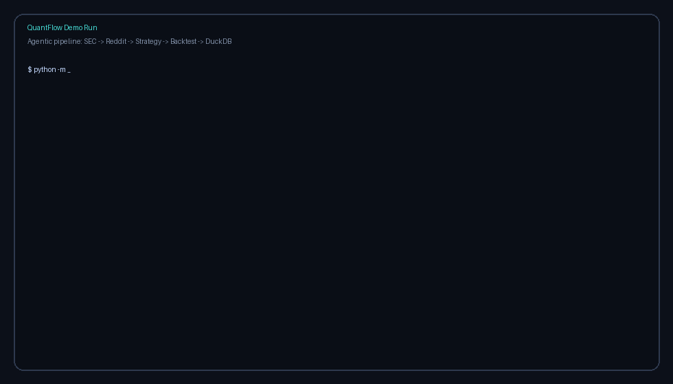
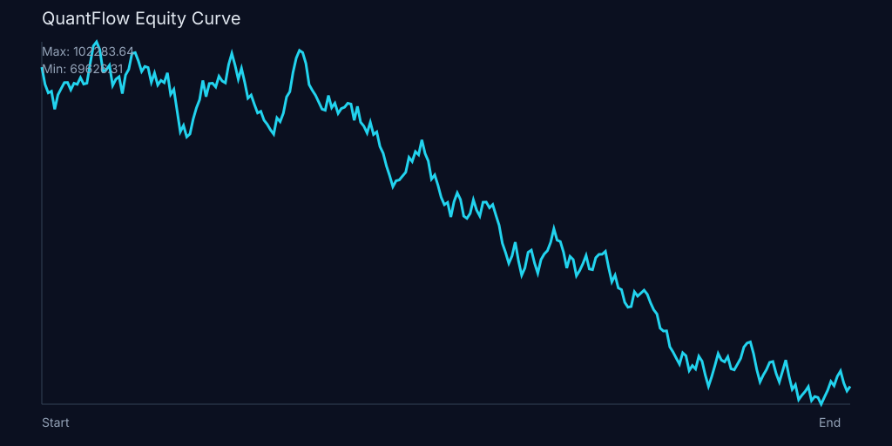

# QuantFlow

Open-source agentic framework for quantitative finance: thesis -> data agents -> strategy -> deterministic backtest -> DuckDB analytics.


## Repository Metadata

Use `scripts/set_github_metadata.ps1` to set GitHub description, homepage, and topics in one shot:

```powershell
$env:GITHUB_TOKEN="YOUR_PAT"
.\scripts\set_github_metadata.ps1
```

## Demo



Sample output artifacts from:

```bash
python -m quantflow run "short small-cap biotech on FDA rejection patterns" --ticker XBI --offline --verbose
```

### Equity Curve (Generated)



### DuckDB Backtest Snapshot

```text
| run_id           | ticker | side  | sharpe  | max_drawdown | calmar  |
| ---------------- | ------ | ----- | ------- | ------------ | ------- |
| 20260422T235445Z | XBI    | short | -1.9527 | -0.3193      | -0.9041 |
| 20260422T233723Z | XBI    | short | -1.9527 | -0.3193      | -0.9041 |
```

## What Is In This Repo

- **Python core (`quantflow/`)**: SEC + Reddit agents, strategy orchestration, backtest runtime, report generation.
- **Go interface (`cmd/`, `internal/quantflowui/`)**: interactive Bubble Tea TUI to run and monitor the full pipeline.
- **Rust scaffold (`engine-rs/`)**: JSON-driven deterministic backtest binary for low-latency evolution.
- **DuckDB layer**: persisted filings, sentiment, strategies, and backtest metrics.

## Quick Start

```bash
python -m venv .venv
.venv\Scripts\activate
pip install -r requirements.txt
python -m quantflow run "short small-cap biotech on FDA rejection patterns" --ticker XBI --offline --verbose
```

Artifacts are stored in `runs/<run_id>/` and analytics in `quantflow.duckdb`.

## Go TUI (Bubble Tea)

The TUI gives a live, demo-friendly view of pipeline stages and streaming logs.

```bash
go run . tui
```

Key controls:

- `tab` / `up` / `down`: switch input field
- `o`: toggle offline fixture mode
- `enter`: run pipeline
- `r`: rerun with current inputs
- `q`: quit

## Go CLI Wrapper

Run the Python pipeline through Go (useful for demos and automation):

```bash
go run . run "short small-cap biotech on FDA rejection patterns" --ticker XBI --offline --verbose
```

## Architecture

1. SEC Filing Agent fetches and scores `10-K`, `10-Q`, `8-K` signals.
2. Reddit Sentiment Agent measures ticker mention velocity and sentiment.
3. Strategy Orchestrator converts thesis + signals into executable strategy rules.
4. Backtest Engine computes Sharpe, max drawdown, Calmar, CAGR, return series.
5. DuckDB captures intermediate and final outputs for reproducible analysis.
6. Artifact exporter writes `report.json`, strategy code, run README, and chart.

## AI Engineering Notes

- Current implementation uses a deterministic strategy-orchestration policy for reproducibility.
- LLM slot is intentionally isolated in `quantflow/agents/strategy.py` to swap in Claude/GPT orchestration.
- DuckDB acts as the memory/analytics substrate so future LLM reasoning can query run history without refetching raw data.

## Strategic Direction

QuantFlow is positioned as an open foundational engine for production-grade systematic research workflows, including startup-scale commercialization paths (managed execution + strategy registry).

See:

- `docs/axiom-positioning.md`
- `docs/architecture-deep-dive.md`

## Development

```bash
pytest -q
go test ./...
```
